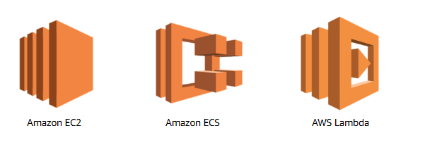
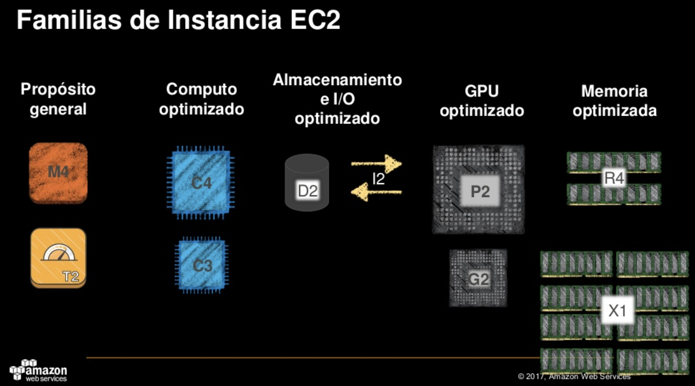
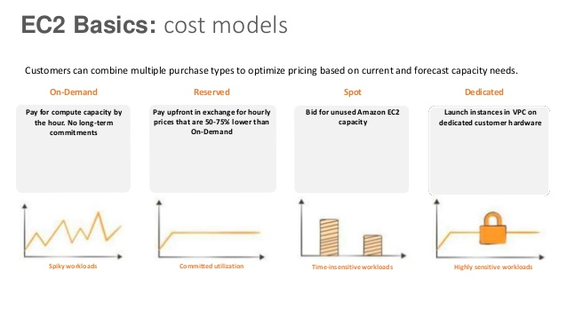

# AWS Compute services

Representado atravez de los siguientes servicios:

## 1. Amazon EC2

Es el recurso primario de computo, este provee servicios remotos de computo, con el completo control sobre el redimensionamiento de la capacidad según la necesidad.

podemos clasificar las instancias de EC2 de la siguiente manera:

donde debemos tener en cuenta lo anterior para determinar que tipo de instancias son las ideales para nuestro proyecto, las instancias de proposito general estan orientadas a trabajar aplicaciones con alto trafico utilizando recursos de cpu y memoria balanceadamente segun las necesidades.

Las instancias de computacion optimizada nos ayuda para trabajos computacionales altamente demandados y que requieren de muchos recursos, las instancias que estan orientandas a optimizar almacenamiento estas proveen condiciones optimas para aplicaciones que exigen recursos en altas cantidades ideal para trabajar con dataset.

Gpu optimizado provee proveen las condiciones para procesos paralelos que necesiten recursos de gpu como trabajos 3D, Renderizado y procesos multimedia. Las instancias como memoria optimizada son ideales para procesos de analitica y bases de datos  con alta demanda.

Las instancias pequeñas estan orientadas a ser ambientes de desarrollo que permiten hacer experimentos, testear ideas, etc.

### Amazon EC2 Modelo de Precios

AWS basa su modelo de precios en una combinación ideal para sus clientes de los siguientes puntos:

* *Bajo demanda:* tienes la capacidad de pagar por hora segun los recursos consumidos transformando la antigua necesidad costosa de matenimiento y actualizacion a un modelo más económico y optimizado.

* *Reserva de instancias:* con este modelo de precio podemos reservar maquinas de forma que se realice un pago anticipado obteniendo de esta manera un descuento significativo, usando este modelo tu puedes asegurar  un uso del 50% - 75% mas bajo que la tasa bajo demanda. Este modelo es bueno para flujos de trabajo con utilidad definida.

* *Instancias puntuales:*  habilita una oferta de recursos sin utilizar de Amazon EC2 , el cual flúctua dependiendo  de la oferta definida, esto permite un flujo de trabajo que no depende del tiempo y pueden ser interrumpidos.

* *Instancias dedicadas:* diseñadas para ejecuar instancias aisladas y dedicada a un simple cliente,generalmente se usa para ejecutar librerias de terceros.

## 2. Amazon ECS

Es el container magagment services de AWS, soporta docker container, aquí tu puedes ejecutar instancias de EC2 que soportan docker container permitiendo utilizando este servicio el manejar estos contenedores.

### Beneficios

1. Amazon ECS elimina la necesidad de instalar, operar y escalar nuestro propio  cluster.

2. con simples llamdos tenemos la capacidad de:
    * Lanzar y detener aplicaciones basadas en contenedores. 
    * Consultar el estado de tu cluster
    * Acceder  a Elastic Load Balancer, EBS Volumes  e IAM Roles.

3. Integrar tus propias politicas y librerias de terceros.

4. No adiciona carga a ECS, continuas pagando lo que uses.

## 3. AWS Lambda

AWS Lambda se puede resumir con los siguientes.puntos clave: 

* Esta basado en eventos los cuales pueden ser clicks del cliente o incluso otros servicios de AWS.

* No requiere manejar infraestructura de computo ni aprovisionar servidores.

* paga por el codigo que usas y el tiempo que toma ejecutar

* Cero administración

## 4. Amazon Elastic Load Balancer

